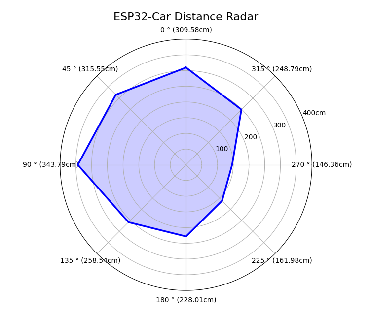
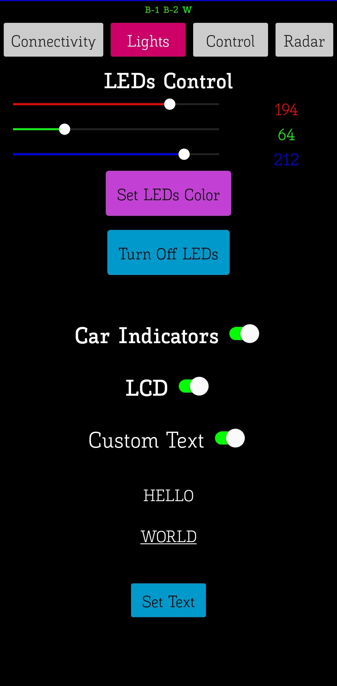

# Design of a Low-Cost Robotic Platform

This repository contains the design and implementation details of a robotic platform: a four-wheeled robot car powered by DC motors. The project focuses on developing a versatile and functional robotic system capable of real-time operations.

This project has been created for the subject Industrial Informatics 2024/25, of the B.S. Industrial Electronics Engineering at the University of Malaga.

  
  

## Features

- **Omnidirectional Movement**: The robot can be controlled to move in any direction.
- **Distance Measurement**: Equipped with sensors to measure distances to various points in its environment.
- **Real-Time Image Transmission**: Capable of capturing and transmitting images in real time.
- **Communication Protocols**:
  - Wi-Fi and MQTT for data transmission.
  - Bluetooth integration for control via an Android application.

## Communication Architecture

1. **Wi-Fi & MQTT**: Handles data exchange between the robot and a server or other devices.
2. **Bluetooth**: Facilitates direct control via a custom Android application.

## Android Application

The project includes a dedicated Android application to:

- Control the robot's movement.
- Visualize real-time data and images.

  
  
  
  

